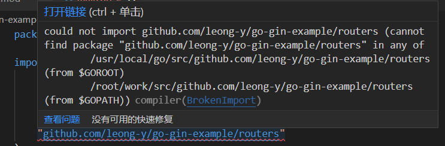

# Go Modules导包遇到的问题

> Go Modules基础

[了解 Go Modules](./了解 Go Modules)


### 1、could not import XXX



## 

我遇到这个问题是因为我平常打开`vscode`喜欢多开一级项目，比如我打开`go-gin-example`会习惯性打开以下目录结构

```bash
.
├── GinLearn
├── GormLearn
└── go-gin-example
```

这就会导致导包不正常，所以如果遇到和我一样问题的话，可以试着一个窗口只打开自己要编写的项目